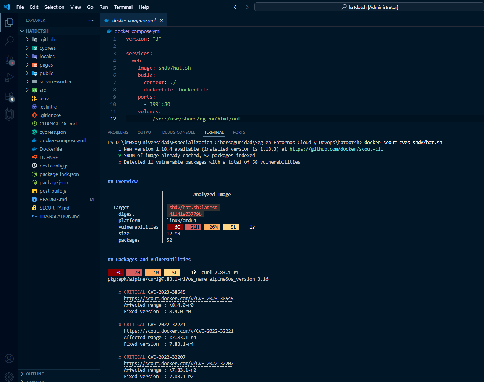

# PROYECTO "HAT.SH REFORGED"
--- 
## Introducción

Este proyecto documenta el proceso de ingeniería inversa, hardening de seguridad y personalización de la aplicación web de código abierto `hat.sh` (https://github.com/sh-dv/hat.sh). El objetivo fue crear una versión más segura, actualizada y con branding personalizado, empaquetada como una nueva imagen Docker y disponible públicamente.

--- 

## 1. Ingeniería Inversa y Análisis de la Aplicación Original

Se realizó un análisis exhaustivo de la estructura de `hat.sh` para comprender su funcionamiento, dependencias y dónde se encontraban los elementos a modificar.

### 1.1 Tecnologías Identificadas

**Frontend:**
- **Next.js 12.1.6**: Framework React para renderizado del lado del servidor y generación de sitios estáticos
- **React 17.0.2**: Biblioteca JavaScript para construir interfaces de usuario
- **Material-UI (MUI) 4.12.4**: Framework de componentes de interfaz de usuario basado en Material Design
  - `@material-ui/core`: Componentes principales
  - `@material-ui/icons`: Iconos Material Design
  - `@material-ui/lab`: Componentes experimentales (Alert, etc.)

**Criptografía:**
- **libsodium-wrappers 0.7.10**: Bindings de JavaScript para libsodium, biblioteca criptográfica moderna y segura
  - Utilizado para operaciones de cifrado/descifrado
  - Soporte para cifrado simétrico (secret key) y asimétrico (public/private key)

**Utilidades y Dependencias:**
- **marked 4.0.16**: Parser de Markdown para documentación
- **prismjs 1.28.0**: Resaltador de sintaxis para código
- **qrcode.react 1.0.1**: Generador de códigos QR para direcciones de donación
- **react-dropzone 14.2.1**: Componente para arrastrar y soltar archivos
- **zxcvbn 4.4.2**: Verificador de fortaleza de contraseñas

**Build Tools:**
- **browserify 17.0.0**: Bundler de módulos para el service worker
- **eslint 8.15.0**: Linter para mantener calidad de código
- **next export**: Generación de sitio estático

**Backend/Servidor:**
- **Nginx stable-alpine**: Servidor web ligero para servir la aplicación estática
- **Node.js Alpine**: Entorno de ejecución para el proceso de build

### 1.2 Estructura del Proyecto

```
hat.sh/
├── src/                        # Carpeta con el código fuente
│   ├── components/             # Componentes React
│   │   ├── AppBar.js           # Barra de navegación
│   │   ├── Footer.js           # Pie de página
│   │   ├── Hero.js             # Sección hero/título principal
│   │   ├── EncryptionPanel.js  # Panel de cifrado
│   │   ├── DecryptionPanel.js  # Panel de descifrado
│   │   ├── KeyPairGeneration.js# Generador de pares de claves
│   │   ├── Settings.js         # Configuraciones (tema, idioma)
│   │   ├── VersionBadge.js     # Badge
│   │   └── limited/            # Componentes para navegadores limitados
│   ├── config/                 # Carpeta de configuracion
│   │   ├── Constants.js        # Constantes
│   │   ├── Theme.js            # Tema (claro/oscuro)
│   │   ├── Language.js         # Sistema de traducción
│   │   └── CheckMultipleTabs.js # Detección de múltiples pestañas
│   ├── utils/                   # Utilidades
│   │   ├── generatePassword.js  # Generador de contraseñas
│   │   ├── passwordStrengthCheck.js # Verificador de fortaleza
│   │   ├── generateAsymmetricKeys.js # Generación de claves asimétricas
│   │   └── computePublicKey.js  # Cálculo de claves públicas
│   ├── helpers/                 # Funciones auxiliares
│   │   ├── formatBytes.js      # Formateo de tamaños de archivo
│   │   └── formatName.js        # Formateo de nombres
│   └── views/                   # Vistas principales
│       ├── MainContainer.js     # Contenedor principal
│       └── LimitedContainer.js  # Contenedor para navegadores limitados
├── pages/                       # Páginas Next.js
│   ├── _app.js                  # Configuración global de la app
│   ├── _document.js             # Documento HTML base
│   ├── index.js                 # Página principal
│   ├── about.js                 # Página "About"
│   ├── generate-keys.js         # Página de generación de claves
│   └── 404.js                   # Página de error 404
├── public/                      # Archivos estáticos
│   ├── assets/
│   │   ├── images/
│   │   │   ├── logo.png         # Logo principal
│   │   │   └── logo2.png        # Logo alternativo
│   │   ├── icons/               # Carpeta de Logos Bitcoin Ethereum etc...
│   │   └── styles/              # Carpeta de Estilos (fuentes, css, resaltado)
│   ├── favicon.ico              # Favicon de la aplicación
│   └── service-worker.js        # Service Worker
├── service-worker/              # Código fuente del Service Worke
├── locales/                     # Archivos de traducción (Ingles, Español, Frances, Aleman, etc...)
├── cypress/                     # Tests end-to-end
├── Dockerfile                   # Archivo Dockerfile
├── docker-compose.yml           # Archivo Docker Compose
├── next.config.js               # Configuración de Next.js
├── post-build.js                # Script post-construcción
├── package.json                 # Dependencias y scripts npm
```

### 1.3 Localización de Branding

Se identificaron los siguientes archivos y líneas de código relevantes para la personalización:

#### **Logos e Iconos:**

1. **Logo Principal en AppBar:**
   - **Archivo**: `src/components/AppBar.js`
   - **Línea 37**: ``
   - **Ubicación**: `public/assets/images/logo.png`
   - **Uso**: Logo visible en la barra de navegación superior, enlazado a la página principal

2. **Logo Alternativo:**
   - **Archivo**: `public/assets/images/logo2.png`
   - **Uso**: En otros componentes o versiones alternativas

3. **Favicon:**
   - **Archivo**: `public/favicon.ico`
   - **Uso**: Icono mostrado en pestañas del navegador y marcadores

4. **Logos de Criptomonedas (Donaciones):**
   - **Archivos**:
     - `public/assets/icons/btc-logo.png` (Bitcoin)
     - `public/assets/icons/eth-logo.png` (Ethereum)
     - `public/assets/icons/xmr-logo.png` (Monero)
   - **Uso**: Mostrados en códigos QR y diálogo de donaciones
   - **Referencia**: `src/components/Footer.js` líneas 173, 238

5. **Logo Ko-fi:**
   - **Archivo**: `public/assets/icons/ko-fi.png`
   - **Uso**: Botón de donación alternativa
   - **Referencia**: `src/components/Footer.js` línea 280

#### **Textos y Leyendas:**

1. **Título de la Aplicación:**
   - **Archivo**: `src/components/Hero.js`
   - **Línea 27**: `{"Hat.sh"}`
   - **Uso**: Título principal

2. **Título en AppBar (_app.js):**
   - **Archivo**: `pages/_app.js`
   - **Línea 15**: `{"Hat.sh"}`
   - **Uso**: Título de la aplicación

3. **Créditos del Desarrollador (Footer):**
   - **Archivo**: `src/components/Footer.js`
   - **Líneas 158-166**:
     ```javascript
     Built and developed by{" "}
     <Link
       href="https://github.com/sh-dv"
       target="_blank"
       rel="noopener"
       color="inherit"
     >
       {"sh-dv"}
     </Link>
     ```
   - **Uso**: Texto de créditos

4. **Enlace a GitHub:**
   - **Archivo**: `src/components/AppBar.js`
   - **Línea 47**: `href="https://github.com/sh-dv/hat.sh"`
   - **Uso**: Botón de GitHub en la barra de navegación

5. **Mensaje de Donación:**
   - **Archivo**: `src/components/Footer.js`
   - **Línea 202-204**:
     ```javascript
     Hat.sh is an open-source application. The project is
     maintained in my free time. Donations of any size are
     appreciated.
     ```
   - **Uso**: Texto descriptivo en el diálogo de donaciones

6. **Chip de Donaciones:**
   - **Archivo**: `src/components/Footer.js`
   - **Línea 175**: `label="Donations Accepted"`
   - **Uso**: Chip clickeable que abre el diálogo de donaciones

7. **Traducciones de Donación:**
   - **Archivos**: `locales/*/index.js`
   - **Clave**: `donation_message`
   - **Ejemplos**:
     - `en_US`: "Love hat.sh? You can donate to support the project."
     - `es_ES`: "¿Te encanta hat.sh? Puedes donar para apoyar el proyecto."
   - **Uso**: Mensaje traducido mostrado en snackbar de donación

#### **Constantes y Configuración:**

- **Archivo**: `src/config/Constants.js`
  - Línea 8: `v1: "Encrypted Using Hat.sh"` - Mensaje de identificación de archivos cifrados
- **Archivo**: `service-worker/config.js`
  - Línea 5: `v1: "Encrypted Using Hat.sh"` - Configuración del service worker

---

## 2. Análisis de Vulnerabilidades con DockerScout

Se utilizó DockerScout para escanear la imagen Docker base de `hat.sh` desde el dockerhub oficial de hat.sh

### 2.1 Análisis con DockerScout

**DockerScout** es una herramienta integrada en Docker Desktop que permite escanear imágenes Docker en busca de vulnerabilidades conocidas (CVEs) en las dependencias y capas base.

**Comandos de Escaneo:**

```bash
docker run -d --name hatdotsh -p 3991:80 shdv/hat.sh
docker scout cves shdv/hat.sh
```

```bash
docker scout recommendations --tag shdv/hat.sh
```

<p align="center">
  <a href="#" rel="noopener">
 </a>
</p>

**Información que proporciona DockerScout:**
- **Lista de CVEs encontrados con severidad (Critical, High, Medium, Low)**

    | Severidad | Cantidad |
    |-----------|----------|
    | **Crítica** | 6 |
    | **Alta-Media** | 21 |
    | **Media** | 26 |

- **Versiones afectadas de paquetes**

    | Paquete | CVEs |
    |-----------|----------|
    | **curl** | 30+ |
    | **openssl** | 11 |
    | **libxml2** | 3 |
    | **nginx** | 3 |

- **Versiones recomendadas con parches**

    | Paquete | Versión fija recomendada |
    |-----------|----------|
    | **curl** | 8.4.0-r0 o superior |
    | **pcre2** | 10.40-r0 o superior |
    | **zlib** | 1.2.12-r2 o superior |
    | **nginx** | 1.22.1-r1 o superior |
    | **oppenssl** | 1.1.1u-r2 o superior |

- **Capas de la imagen donde se encuentran las vulnerabilidades:**
    Todas las vulnerabilidades provienen de la imagen base que es Alpine en su version 3.16, por lo que el problema es la imagen raíz obsoleta.

- **Recomendaciones de actualización:**
    - Usar una base más reciente como alpine:latest o similar.
    - Parchear paquetes usando por ejemplo:
        ```bash
        FROM shdv/hat.sh

        RUN apk update && apk upgrade
        ```
    - Usar un NGINX más reciente como nginx:1.26-alpine

---

## 3. Resumen de Vulnerabilidades Identificadas

  * **CVE-2022-32221:** Uso incorrecto de la función de lectura al reutilizar un handle en libcurl, lo que puede causar envío de datos erróneos o uso de memoria después de liberarse, Afecta a libcurl, Severidad **CRITICAL.**
>
  * **CVE-2023-38545:** Buffer Overflow en el handshake SOCKS5 cuando curl pasa un hostname >255 bytes al proxy, pudiendo sobrescribir memoria en heap, Afecta a curl, Severidad **CRITICAL.**
>
  * **CVE-2022-32207:** Al guardar cookies, alt-svc o HSTS, curl puede cambiar permisos del archivo destino tras un rename, dejando el archivo más accesible de lo previsto, Afecta a curl, Severidad **CRITICAL.**
>
  * **CVE-2022-37434:** Lectura fuera de límites o desbordamiento de buffer en inflate() al procesar campos “extra” grandes en cabeceras gzip, afecta solo a apps que usan inflateGetHeader, Afecta a zlib, Severidad **CRITICAL.**
>
  * **CVE-2022-1586:** Lectura fuera de límites en PCRE2 al procesar expresiones regulares JIT por manejo incorrecto de propiedades Unicode en coincidencias sin distinción de mayúsculas/minúsculas, Afecta a PCRE2, Severidad **CRITICAL.**
>
  * **CVE-2022-1587:** Lectura fuera de límites en PCRE2 dentro de get_recurse_data_length() al procesar recursiones en expresiones regulares JIT debido a duplicación de datos, Afecta a PCRE2, Severidad **CRITICAL.**
>
  * **CVE-2023-27534:** Vulnerabilidad de path traversal en SFTP donde ~ se sustituye incorrectamente en el primer elemento de la ruta, permitiendo evadir filtros o ejecutar código arbitrario con rutas manipuladas, Afecta a curl, Severidad **HIGH.**
>
  * **CVE-2023-27533:** Validación insuficiente en el manejo TELNET permite inyectar usuario/opciones manipuladas durante la negociación, posibilitando envío de contenido malicioso o ejecución de código, Afecta a curl, Severidad **HIGH.**
>
  * **CVE-2023-4863:** Desbordamiento de buffer en heap de libwebp al procesar páginas HTML manipuladas, permitiendo escritura fuera de límites por un atacante remoto, Afecta a libwebp, Severidad **HIGH.**
>
  * **CVE-2022-42915:** Error en el manejo de limpieza ante fallos usando proxy HTTP con URLs no-HTTP(S) puede provocar double free al usar ciertos esquemas (dict, gopher, ldap, rtmp, telnet), Afecta a curl, Severidad **HIGH.**
  
---

## 4. Personalización y Branding

### 4.1 Reemplazo de Logos

**Proceso de personalización:**

1. **Logo Principal:**
   - Se reemplaza `public/assets/images/logo.png` con logo personalizado
   - Posibles Formatos: PNG, SVG (preferible para escalabilidad)

2. **Logo Alternativo:**
   - Se reemplaza el logo alternativo `public/assets/images/logo2.png`

3. **Favicon:**
   - Se reemplaza `public/favicon.ico`

### 4.2 Modificación de Textos y Leyendas

**Archivos modificados:**

1. **Título de la Aplicación:**
   - `src/components/Hero.js` línea 27: Cambiado a `"HatDotSh"`
   - `pages/_app.js` línea 15: Se actualiza el título

2. **Créditos del Desarrollador:**
   - `src/components/Footer.js` líneas 158-166:
     - Se Cambia texto "Built and developed by"
     - Actualizar enlace y nombre "sh-dv" por información personalizada

3. **Mensajes de Donación:**
   - `src/components/Footer.js` línea 175: Modifica chip "Donations Accepted"
   - Actualizar o eliminar direcciones de criptomonedas (líneas 101-117)
   - Actualizar enlace de Ko-fi (línea 276)

### 4.3 Personalización de Estilos

**Archivos de estilos:**
- `public/assets/styles/style.css`: Estilos principales
- `src/config/Theme.js`: Configuración de tema oscuro

---

## 5. Compilación de la Aplicación y Creación de la Imagen Docker

- **DockerHub:** https://hub.docker.com/r/m0xx25/hatdotsh
- **Github:** https://github.com/M0xX18/hatdotsh

## 6. Conclusiones

Este proyecto refleja el proceso de:

1. **Ingeniería Inversa:** Análisis exhaustivo de la estructura y funcionamiento de una aplicación web moderna.
2. **Análisis de Seguridad:** Uso de herramientas FOSS para identificar vulnerabilidades.
3. **Hardening:** Implementación de mejores prácticas de seguridad en Docker y aplicación.
4. **Personalización:** Modificación de branding y elementos visuales.
5. **DevOps:** Construcción, optimización y despliegue de imágenes Docker.

## 7. Créditos

**Proyecto Original:**
- Desarrollado por: sh-dv
- Repositorio: https://github.com/sh-dv/hat.sh

---